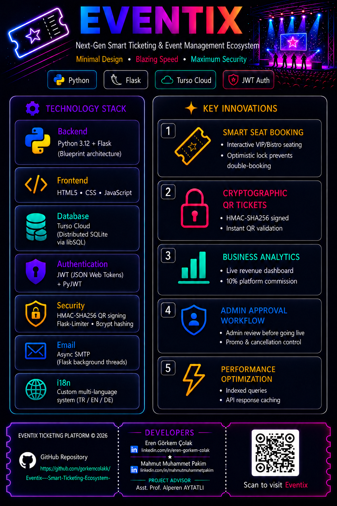
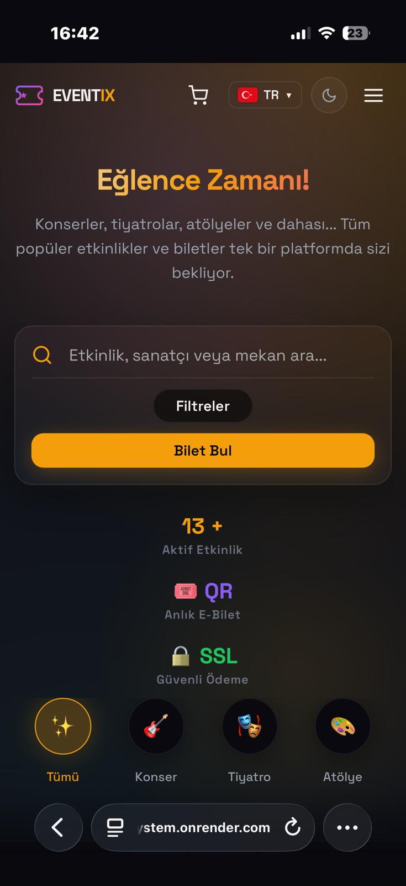
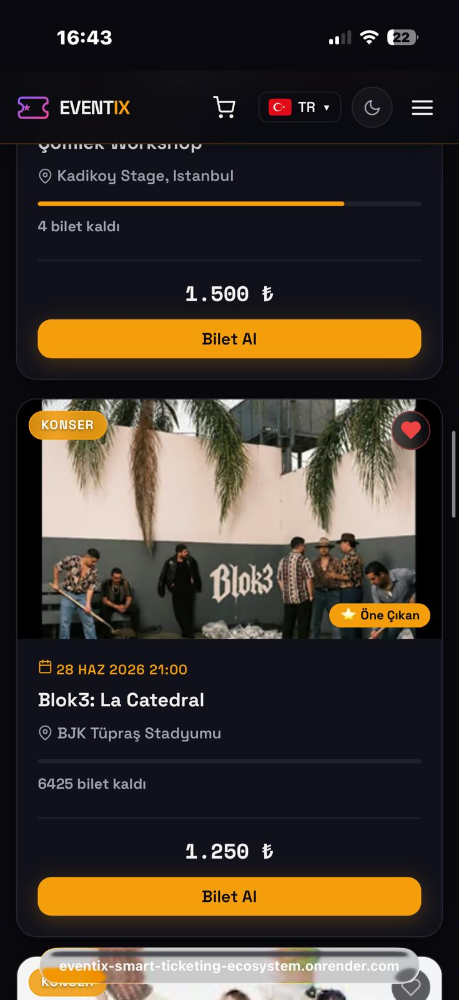
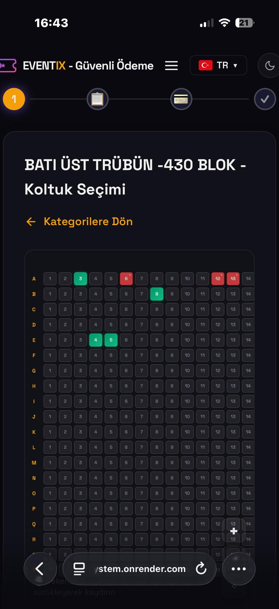
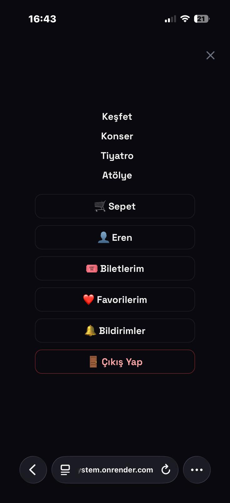
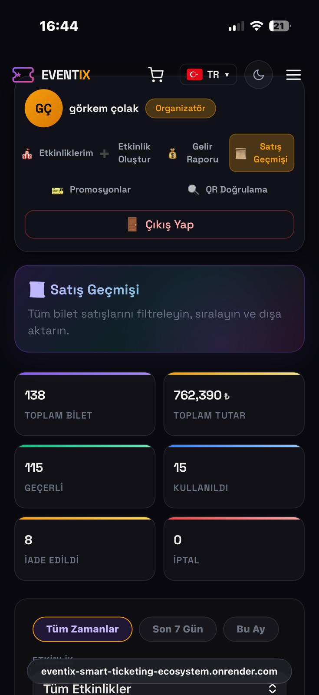
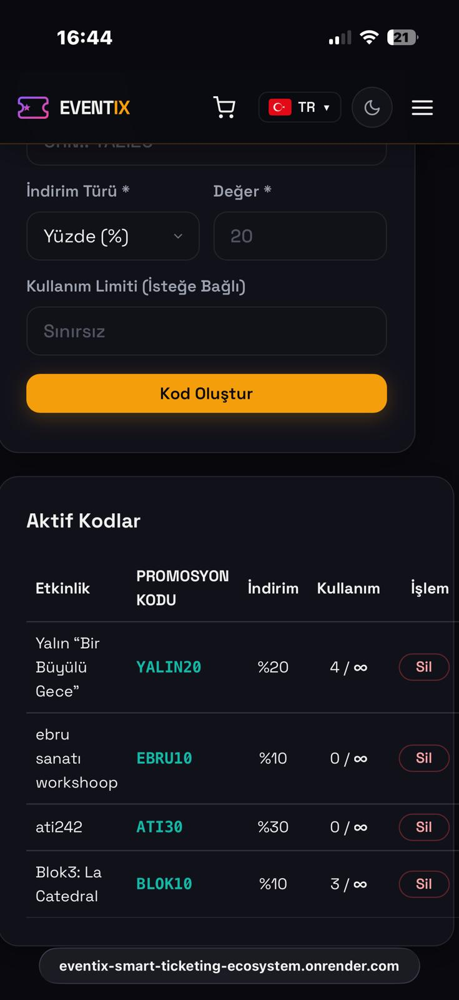

  
   

<!-- LOGO SVG - Bilet tasarımı -->
<svg xmlns="http://www.w3.org/2000/svg" width="80" height="80" viewBox="0 0 80 80">
  <defs>
    <linearGradient id="rg1" x1="0%" y1="0%" x2="100%" y2="100%">
      <stop offset="0%" style="stop-color:#8b5cf6"/>
      <stop offset="100%" style="stop-color:#ec4899"/>
    </linearGradient>
  </defs>
  <rect x="8" y="20" width="64" height="40" rx="7" fill="url(#rg1)" opacity="0.95"/>
  <circle cx="8" cy="40" r="7" fill="#0f0f1a"/>
  <circle cx="72" cy="40" r="7" fill="#0f0f1a"/>
  <line x1="20" y1="40" x2="60" y2="40" stroke="rgba(255,255,255,0.35)" stroke-width="1.5" stroke-dasharray="4 3"/>
  <circle cx="40" cy="40" r="7" fill="rgba(255,255,255,0.18)"/>
  <path d="M37 40l2 2 4-4" stroke="#ffffff" stroke-width="1.8" fill="none" stroke-linecap="round" stroke-linejoin="round"/>
</svg>

# Eventix — Biletleme & Etkinlik Yönetim Platformu

### *Katılımcılar için eşsiz bir deneyim, organizatörler için maksimum kontrol.*

 

 

---

## 📌 İçindekiler

- [Proje Hakkında](#-proje-hakkında)
- [Canlı Demo & Ekran Görüntüleri](#-canlı-demo--ekran-görüntüleri)
- [Temel Özellikler](#-temel-özellikler)
- [İletişim](#-iletişim)

---

## 🎯 Proje Hakkında

**Eventix**, konserlere, festivallere, tiyatro gösterilerine, workshoplara ve daha fazlasına bilet satın almayı ve etkinlik yönetmeyi kolaylaştıran **tam yığın (full-stack) bir biletleme platformudur.** Flask ile geliştirilmiş RESTful bir backend, saf HTML/CSS/JavaScript ile oluşturulmuş modern bir frontend ve Turso (dağıtık SQLite) cloud veritabanını bir araya getirir.

Platform; **3 farklı kullanıcı rolü** (Müşteri, Organizatör, Admin) ile çalışır ve her rol için özel bir kontrol paneli sunar. Bilet satın alındığı anda HMAC-SHA256 ile imzalı benzersiz QR kodlar üretilir ve kullanıcıya HTML tasarımlı e-bilet mail olarak gönderilir.

**Neden Eventix?**
- 🌍 **Çok dilli:** Türkçe, İngilizce ve Almanca tam destek
- 🔐 **Güvenli:** JWT kimlik doğrulama, rate limiting, HMAC imzalı QR kodlar
- ⚡ **Hızlı:** Turso Cloud ile küresel dağıtık veritabanı, sunucu taraflı önbellekleme
- 🎨 **Modern:** Dark mode öncelikli, glassmorphism ve gradient tasarım
- 📧 **Akıllı:** Doğum günü e-postaları, iade bildirimleri, kapıda QR doğrulama

---

## 🖼️ Canlı Demo & Ekran Görüntüleri

> 🚀 **[Canlı Projeyi Görüntüle: Eventix Ticketing Platform](https://eventix-smart-ticketing-ecosystem.onrender.com/index.html)**

---

### 📱 Mobil Uyumluluk (Responsive)

  
  
  

 

  
  
  

---

### Ana Sayfa

  
   Hero alanı, arama/filtrele ve navigasyon

 

  
   Öne çıkan popüler konser, tiyatro ve atölye kartları

 

### Giriş & Kayıt

| Giriş Sayfası | Kayıt Sayfası |
| :---: | :---: |
|  |  |

---

### Etkinlik Detay & Oturma Planı

  
   Etkinlik detay sayfası — yüksek çözünürlüklü afiş, açıklama ve kurallar

 

  
   Stadyum/Mekan oturma planı önizlemesi ve entegre Google Maps görünümü

---

### Bilet Seçimi (Kategori & Koltuk Seçimi)

| Kategori / Bilet Türü Seçimi | Numaralı Koltuk Seçimi (Matris) |
| :---: | :---: |
|  |  |

---

### Dijital E-Bilet (Mail)

  
   Ödeme tamamlandıktan sonra oluşturulan QR kodlu HTML/PDF E-Bilet formatı

---

### Organizatör Paneli

  
   Organizatörlere özel detaylı gelir grafiği ve istatistik paneli

---

### Admin Paneli

  
   Admin Paneli — Platform geneli gelir özeti ve organizatör dağılımları

 

  
   Gelişmiş filtreleme ile detaylı bilet satış geçmişi tablosu

 

  
   Platformdaki tüm etkinliklerin takibi, durum yönetimi ve aksiyonlar

---

## ✨ Temel Özellikler

### 🎫 Biletleme Sistemi
- **Ayakta Etkinlikler:** Miktar seçimi, kategori ve fiyat ayrımı (VIP, Bistro, Genel vb.)
- **Numaralı Koltuklu Etkinlikler:** İnteraktif koltuk matrisi (satır/sütun bazlı); her koltuk bağımsız fiyatlandırılabilir
- **Optimistik Kilit Mekanizması:** Koltuk seçildiği anda 5 dakika geçici rezervasyon; ödeme tamamlanmazsa otomatik serbest bırakılır
- **Promosyon Kodları:** Etkinlik bazında yüzdelik veya sabit indirim kodları; kullanım limiti ve tarih aralığı tanımlanabilir
- **Doğum Günü Kuponu:** `BDAY26` — %15 indirim, arka planda çalışan iş parçacığı ile otomatik gönderim
- **İade Sistemi:** Platform komisyonu hesaplanarak bilet iptali ve kısmi iade; iade geçmişi kayıt altında
- **İstek Listesi (Wishlist):** Kullanıcılar etkinlikleri favorilerine ekleyip takip edebilir

### 📧 E-posta Bildirimleri
| Olay | İçerik |
|---|---|
| Bilet Satın Alma | Kişiselleştirilmiş HTML mail + her bilet için ayrı QR kod |
| Doğum Günü | Tam sayfa HTML tebrik + `BDAY26` kupon kodu |
| Şifre Sıfırlama | 15 dakika geçerli JWT bağlantısı |
| Etkinlik İptali | Organizatör / admin tarafından iptal edildiğinde otomatik bildirim |
| İletişim Formu | Admin inbox'a gönderici bilgileriyle birlikte HTML mail |

### 📊 Analitik & Finans
- **%10 Platform Komisyonu** — her satıştan otomatik kesilir
- Organizatör başına net kazanç, etkinlik başına satış oranı
- Admin için platform geneli toplam gelir, en çok satan etkinlikler
- Refund breakdown: müşteriye iade, organizatöre tazminat, admin kesintisi

### 🗺️ Etkinlik Yönetimi
- **Etkinlik Oluşturma:** Başlık, kategori, tarih, konum, fiyat, kapasite, afiş yükleme, açıklama, lineup
- **Numaralı Koltuk Planı:** Zone bazlı blok ve satır/sütun konfigürasyonu
- **Tekrar Eden Etkinlikler:** Günlük / haftalık / aylık periyot ile parent-child seans yapısı
- **Onay Akışı:** Organizatör oluşturur → Admin onaylar/reddeder → Satışa açılır
- **Anlık Yönetim:** Yayındaki etkinliği durdurma, satışları kapatma, yayından kaldırma

### 🎪 Kullanıcı Deneyimi
- **Dark Mode Öncelikli** tasarım, purple-to-pink gradient renk paleti
- Tam **responsive** (mobil, tablet, masaüstü)
- Gerçek zamanlı bildirim sistemi (okunmamış sayaç, inbox görünümü)
- Adım adım checkout progress bar (Bilet → Kişisel Bilgi → Ödeme → Onay)
- Kapıda **QR Kamera Doğrulama** — organizatör kameradan okutup bileti geçerli/geçersiz yapabilir

---

## 📧 İletişim

**Eren Görkem Çolak**

---

**Eventix Ticketing Platform** — © 2026

*Katılımcılar için eşsiz bir deneyim, organizatörler için maksimum kontrol.*

⭐ Bu projeyi beğendiysen yıldız vermeyi unutma!

