<div align="center">

<br/>

<!-- LOGO SVG - Bilet tasarımı -->
<svg xmlns="http://www.w3.org/2000/svg" width="80" height="80" viewBox="0 0 80 80">
  <defs>
    <linearGradient id="rg1" x1="0%" y1="0%" x2="100%" y2="100%">
      <stop offset="0%" style="stop-color:#8b5cf6"/>
      <stop offset="100%" style="stop-color:#ec4899"/>
    </linearGradient>
  </defs>
  <rect x="8" y="20" width="64" height="40" rx="7" fill="url(#rg1)" opacity="0.95"/>
  <circle cx="8" cy="40" r="7" fill="#0f0f1a"/>
  <circle cx="72" cy="40" r="7" fill="#0f0f1a"/>
  <line x1="20" y1="40" x2="60" y2="40" stroke="rgba(255,255,255,0.35)" stroke-width="1.5" stroke-dasharray="4 3"/>
  <circle cx="40" cy="40" r="7" fill="rgba(255,255,255,0.18)"/>
  <path d="M37 40l2 2 4-4" stroke="#ffffff" stroke-width="1.8" fill="none" stroke-linecap="round" stroke-linejoin="round"/>
</svg>

# Eventix — Biletleme & Etkinlik Yönetim Platformu

### *Katılımcılar için eşsiz bir deneyim, organizatörler için maksimum kontrol.*

<br/>

[](https://www.python.org/)
[](https://flask.palletsprojects.com/)
[](https://sqlite.org/)
[](https://turso.tech/)
[](https://jwt.io/)
[](https://opensource.org/licenses/MIT)

<br/>

</div>

---

## 📌 İçindekiler

- [Proje Hakkında](#-proje-hakkında)
- [Canlı Demo & Ekran Görüntüleri](#-canlı-demo--ekran-görüntüleri)
- [Temel Özellikler](#-temel-özellikler)
- [Kullanıcı Rolleri](#-kullanıcı-rolleri)
- [Teknik Mimari](#-teknik-mimari)
- [Veritabanı Şeması](#-veritabanı-şeması)
- [API Rotaları](#-api-rotaları)
- [Kurulum ve Çalıştırma](#-kurulum-ve-çalıştırma)
- [Ortam Değişkenleri](#-ortam-değişkenleri)
- [Çok Dilli Destek](#-çok-dilli-destek)
- [Güvenlik](#-güvenlik)
- [Proje Yapısı](#-proje-yapısı)
- [İletişim](#-iletişim)

---

## 🎯 Proje Hakkında

**Eventix**, konserlere, festivallere, tiyatro gösterilerine, workshoplara ve daha fazlasına bilet satın almayı ve etkinlik yönetmeyi kolaylaştıran **tam yığın (full-stack) bir biletleme platformudur.** Flask ile geliştirilmiş RESTful bir backend, saf HTML/CSS/JavaScript ile oluşturulmuş modern bir frontend ve Turso (dağıtık SQLite) cloud veritabanını bir araya getirir.

Platform; **3 farklı kullanıcı rolü** (Müşteri, Organizatör, Admin) ile çalışır ve her rol için özel bir kontrol paneli sunar. Bilet satın alındığı anda HMAC-SHA256 ile imzalı benzersiz QR kodlar üretilir ve kullanıcıya HTML tasarımlı e-bilet mail olarak gönderilir.

**Neden Eventix?**
- 🌍 **Çok dilli:** Türkçe, İngilizce ve Almanca tam destek
- 🔐 **Güvenli:** JWT kimlik doğrulama, rate limiting, HMAC imzalı QR kodlar
- ⚡ **Hızlı:** Turso Cloud ile küresel dağıtık veritabanı, sunucu taraflı önbellekleme
- 🎨 **Modern:** Dark mode öncelikli, glassmorphism ve gradient tasarım
- 📧 **Akıllı:** Doğum günü e-postaları, iade bildirimleri, kapıda QR doğrulama

---

## 🖼️ Canlı Demo & Ekran Görüntüleri

### Ana Sayfa

<div align="center">
  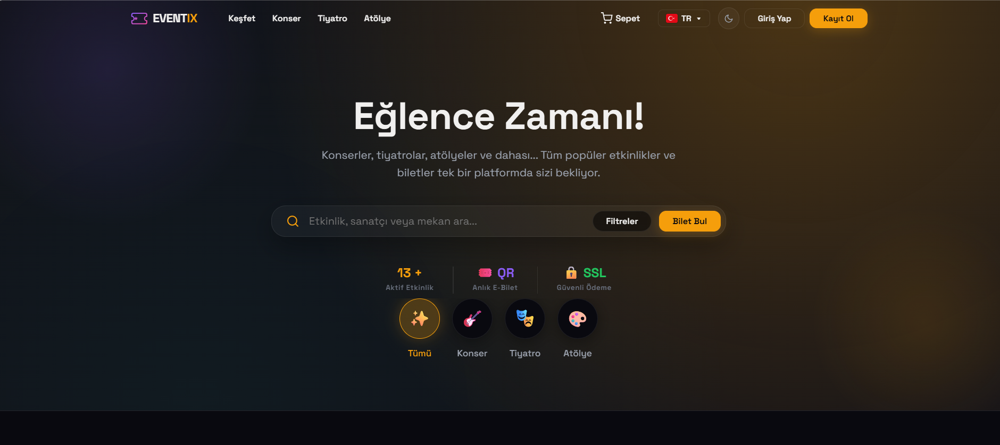
  <br/><sub>Hero alanı, arama/filtrele ve navigasyon</sub>
</div>

<br/>

<div align="center">
  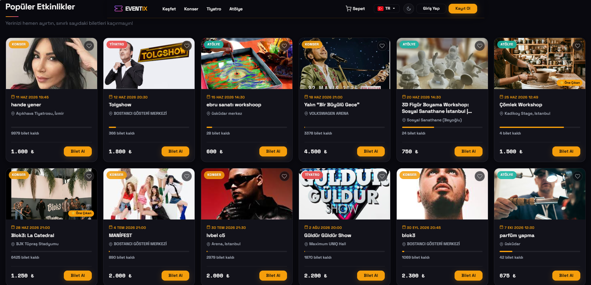
  <br/><sub>Öne çıkan popüler konser, tiyatro ve atölye kartları</sub>
</div>

<br/>

### Giriş & Kayıt

| Giriş Sayfası | Kayıt Sayfası |
| :---: | :---: |
| 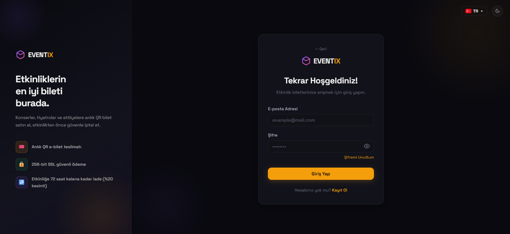 | 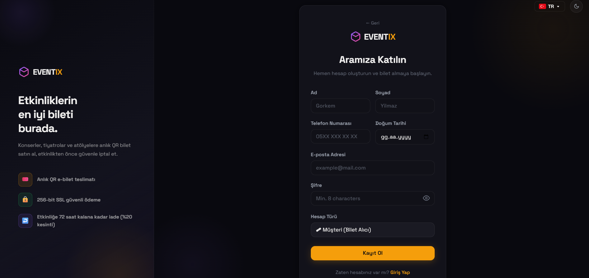 |

---

### Etkinlik Detay & Oturma Planı

<div align="center">
  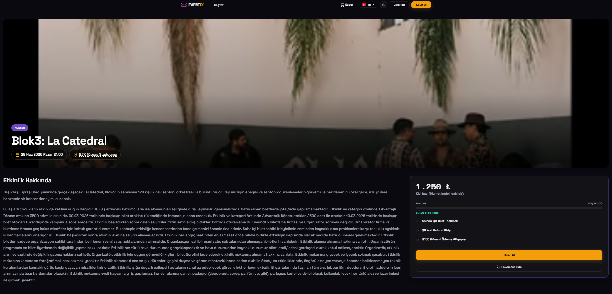
  <br/><sub>Etkinlik detay sayfası — yüksek çözünürlüklü afiş, açıklama ve kurallar</sub>
</div>

<br/>

<div align="center">
  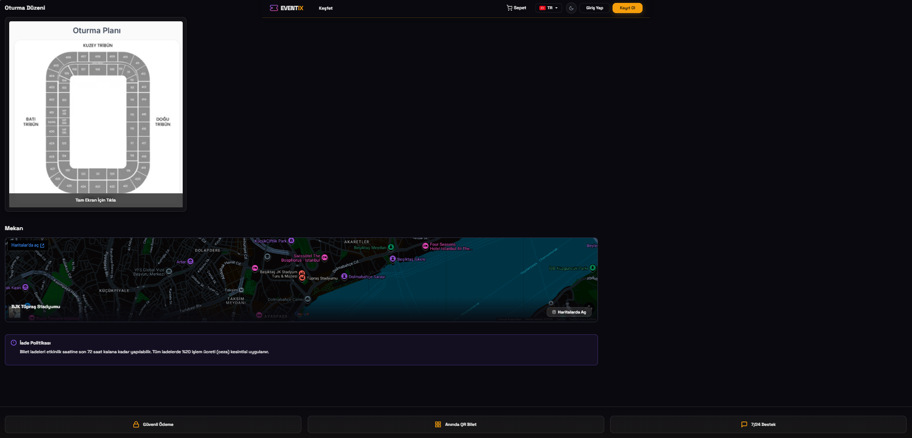
  <br/><sub>Stadyum/Mekan oturma planı önizlemesi ve entegre Google Maps görünümü</sub>
</div>

---

### Bilet Seçimi (Kategori & Koltuk Seçimi)

| Kategori / Bilet Türü Seçimi | Numaralı Koltuk Seçimi (Matris) |
| :---: | :---: |
| 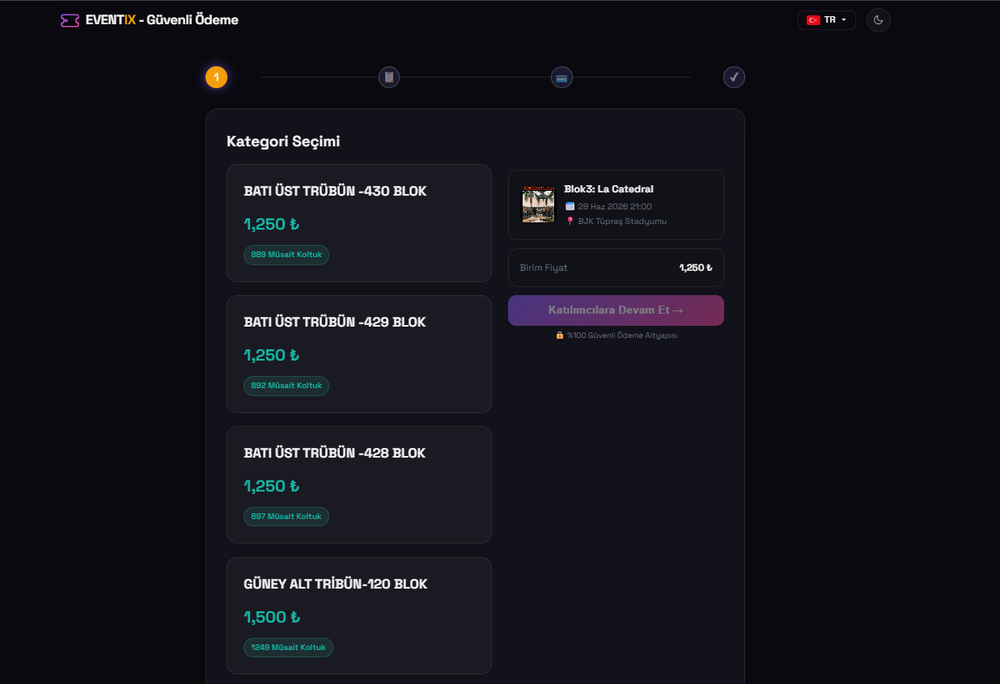 | 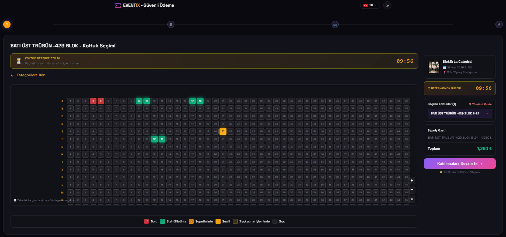 |

---

### Dijital E-Bilet (Mail)

<div align="center">
  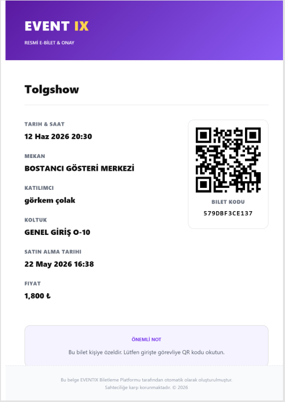
  <br/><sub>Ödeme tamamlandıktan sonra oluşturulan QR kodlu HTML/PDF E-Bilet formatı</sub>
</div>

---

### Organizatör Paneli

<div align="center">
  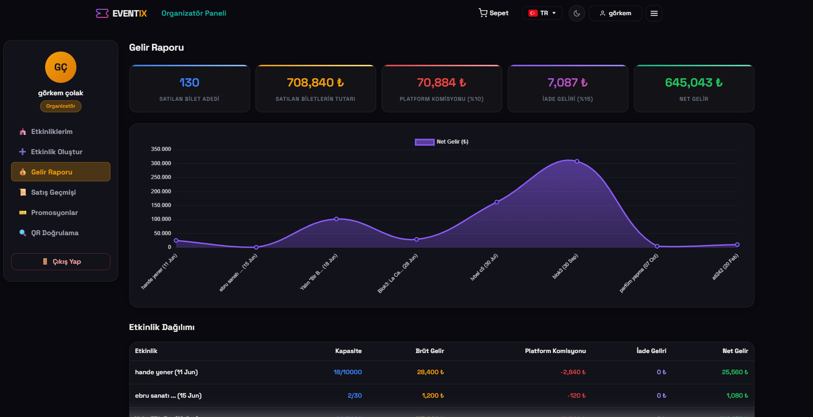
  <br/><sub>Organizatörlere özel detaylı gelir grafiği ve istatistik paneli</sub>
</div>

---

### Admin Paneli

<div align="center">
  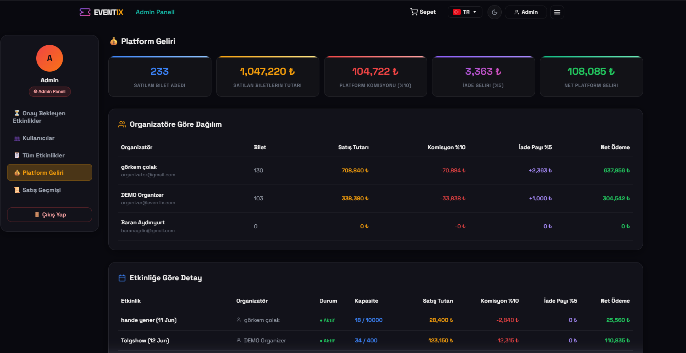
  <br/><sub>Admin Paneli — Platform geneli gelir özeti ve organizatör dağılımları</sub>
</div>

<br/>

<div align="center">
  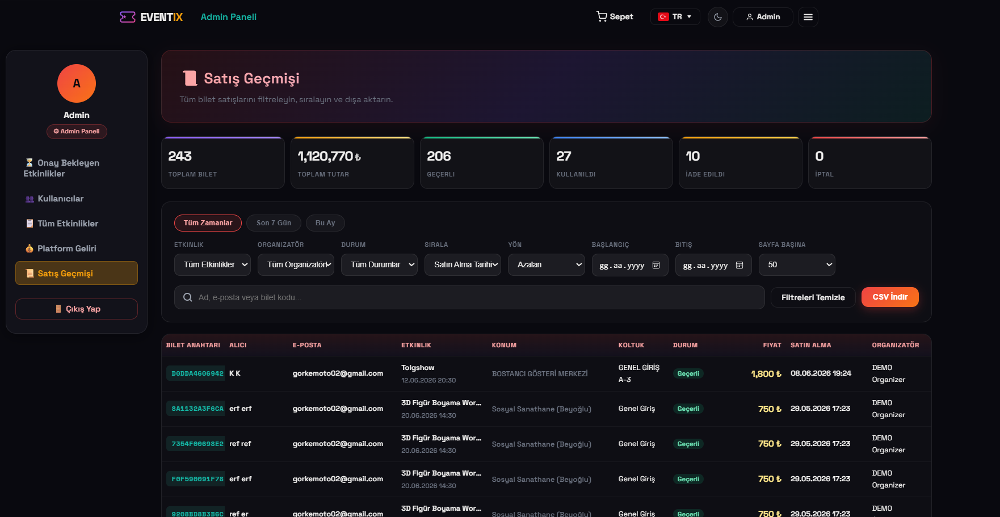
  <br/><sub>Gelişmiş filtreleme ile detaylı bilet satış geçmişi tablosu</sub>
</div>

<br/>

<div align="center">
  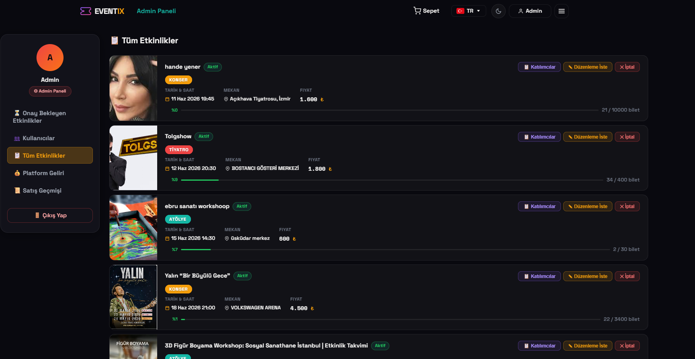
  <br/><sub>Platformdaki tüm etkinliklerin takibi, durum yönetimi ve aksiyonlar</sub>
</div>

---

## ✨ Temel Özellikler

### 🎫 Biletleme Sistemi
- **Ayakta Etkinlikler:** Miktar seçimi, kategori ve fiyat ayrımı (VIP, Bistro, Genel vb.)
- **Numaralı Koltuklu Etkinlikler:** İnteraktif koltuk matrisi (satır/sütun bazlı); her koltuk bağımsız fiyatlandırılabilir
- **Optimistik Kilit Mekanizması:** Koltuk seçildiği anda 5 dakika geçici rezervasyon; ödeme tamamlanmazsa otomatik serbest bırakılır
- **Promosyon Kodları:** Etkinlik bazında yüzdelik veya sabit indirim kodları; kullanım limiti ve tarih aralığı tanımlanabilir
- **Doğum Günü Kuponu:** `BDAY26` — %15 indirim, arka planda çalışan iş parçacığı ile otomatik gönderim
- **İade Sistemi:** Platform komisyonu hesaplanarak bilet iptali ve kısmi iade; iade geçmişi kayıt altında
- **İstek Listesi (Wishlist):** Kullanıcılar etkinlikleri favorilerine ekleyip takip edebilir

### 📧 E-posta Bildirimleri
| Olay | İçerik |
|---|---|
| Bilet Satın Alma | Kişiselleştirilmiş HTML mail + her bilet için ayrı QR kod |
| Doğum Günü | Tam sayfa HTML tebrik + `BDAY26` kupon kodu |
| Şifre Sıfırlama | 15 dakika geçerli JWT bağlantısı |
| Etkinlik İptali | Organizatör / admin tarafından iptal edildiğinde otomatik bildirim |
| İletişim Formu | Admin inbox'a gönderici bilgileriyle birlikte HTML mail |

### 📊 Analitik & Finans
- **%10 Platform Komisyonu** — her satıştan otomatik kesilir
- Organizatör başına net kazanç, etkinlik başına satış oranı
- Admin için platform geneli toplam gelir, en çok satan etkinlikler
- Refund breakdown: müşteriye iade, organizatöre tazminat, admin kesintisi

### 🗺️ Etkinlik Yönetimi
- **Etkinlik Oluşturma:** Başlık, kategori, tarih, konum, fiyat, kapasite, afiş yükleme, açıklama, lineup
- **Numaralı Koltuk Planı:** Zone bazlı blok ve satır/sütun konfigürasyonu
- **Tekrar Eden Etkinlikler:** Günlük / haftalık / aylık periyot ile parent-child seans yapısı
- **Onay Akışı:** Organizatör oluşturur → Admin onaylar/reddeder → Satışa açılır
- **Anlık Yönetim:** Yayındaki etkinliği durdurma, satışları kapatma, yayından kaldırma

### 🎪 Kullanıcı Deneyimi
- **Dark Mode Öncelikli** tasarım, purple-to-pink gradient renk paleti
- Tam **responsive** (mobil, tablet, masaüstü)
- Gerçek zamanlı bildirim sistemi (okunmamış sayaç, inbox görünümü)
- Adım adım checkout progress bar (Bilet → Kişisel Bilgi → Ödeme → Onay)
- Kapıda **QR Kamera Doğrulama** — organizatör kameradan okutup bileti geçerli/geçersiz yapabilir

---

## 👥 Kullanıcı Rolleri

```
┌─────────────────────────────────────────────────────────────────┐
│                          EVENTIX                                │
│                                                                 │
│  👤 MÜŞTERİ           🎪 ORGANİZATÖR         👑 ADMİN         │
│  ─────────────         ──────────────         ──────────        │
│  • Etkinlik ara        • Etkinlik oluştur     • Etkinlik onayla │
│  • Bilet satın al      • Seating düzenle      • Etkinlik durdur │
│  • QR ile giriş        • Tekrarlı seans       • Kullanıcı yönet │
│  • Wishlist tut        • Promo kod ekle       • İade işle       │
│  • İade talep et       • QR kapı doğrula      • Finans görüntüle│
│  • Bildirim al         • Gelir raporları      • Platform ayarları│
│  • Profil düzenle      • Analitik dashboard   • Tüm etkinlikler │
└─────────────────────────────────────────────────────────────────┘
```

---

## 🏗️ Teknik Mimari

```
eventix/
├── app.py                  # Flask uygulama fabrikası, blueprint kaydı, i18n, birthday job
├── database.py             # Bağlantı yöneticisi (SQLite ↔ Turso HTTP API), şema init
├── utils.py                # JWT auth, QR üretimi, SMTP mailer, HMAC imzalama
├── translations.py         # Türkçe / İngilizce / Almanca çeviri sözlüğü (~3500 satır)
├── payment.py              # Ödeme simülasyonu ve doğrulama
├── routes/
│   ├── auth.py             # /api/auth — kayıt, giriş, şifre sıfırlama
│   ├── events.py           # /api/events — liste, detay, arama, filtreleme
│   ├── tickets.py          # /api/tickets — satın alma, iade, QR doğrulama
│   ├── organizer.py        # /api/organizer — etkinlik CRUD, seans, promo
│   ├── admin.py            # /api/admin — onay, kullanıcı, finans
│   ├── users.py            # /api/users — profil güncelleme, bildirimler
│   ├── wishlist.py         # /api/wishlist — ekle, çıkar, listele
│   ├── notifications.py    # /api/notifications — bildirim yönetimi
│   ├── contact.py          # /api/contact — iletişim formu
│   └── upload.py           # /api/upload — medya yükleme
├── templates/              # Jinja2 şablonları (i18n context processor ile)
│   ├── index.html          # Ana sayfa
│   ├── event-detail.html   # Etkinlik detay
│   ├── checkout.html       # Numaralı koltuk seçimi + checkout
│   ├── cart.html           # Sepet (ayakta etkinlikler)
│   ├── cart-checkout.html  # Ayakta etkinlik checkout
│   ├── dashboard.html      # Kullanıcı paneli
│   ├── organizer.html      # Organizatör paneli
│   ├── admin.html          # Admin paneli
│   ├── login.html          # Giriş
│   ├── register.html       # Kayıt
│   └── partials/           # Navbar, footer, ortak bileşenler
└── frontend/               # Statik dosyalar (CSS, JS, görseller)
    └── styles/
        └── main.css        # Global tasarım sistemi
```

### Veri Akışı

```
Tarayıcı (HTML/JS)
      │
      │ REST API (JSON)
      ▼
Flask Blueprint Router
      │
      ├─► JWT Middleware (token_required / role_required)
      │
      ├─► Rate Limiter (Flask-Limiter)
      │
      ├─► Route Handler
      │         │
      │         ├─► database.py → Turso HTTP API / SQLite
      │         └─► utils.py   → Email · QR · HMAC
      │
      └─► Jinja2 Template (i18n context)
```

---

## 🗄️ Veritabanı Şeması

```sql
users          — id, fullname, email, password(hashed), role, phone, birthdate
events         — id(UUID), title, category, date, location, price, capacity,
                 sold_count, status, organizer_id, has_seating, seating_image,
                 parent_event_id, recurring_config, version(optimistic lock)
seats          — id, event_id, zone, row_label, col_label, price, status,
                 version, locked_until, locked_by_session
tickets        — id, user_id, event_id, ticket_key, qr_code, quantity,
                 total_price, status, seat_id, owner_name, owner_surname,
                 promo_code, original_price, purchase_date, refunded_at
refunds        — id, ticket_id, user_id, event_id, original_price,
                 refund_to_customer, organizer_compensation, admin_fee
promotions     — id, event_id, code, discount_type, discount_value,
                 valid_from, valid_until, usage_limit, used_count
wishlist       — id, user_id, event_id, added_at
notifications  — id, user_id, message, is_read, created_at
```

**Performans İndeksleri:**
```sql
idx_events_status_parent  ON events(status, parent_event_id)
idx_events_date           ON events(date)
idx_events_price          ON events(price)
idx_events_location       ON events(location)
```

---

## 🔌 API Rotaları

### Kimlik Doğrulama — `/api/auth`
| Method | Endpoint | Açıklama | Rate Limit |
|--------|----------|----------|------------|
| POST | `/register` | Yeni kullanıcı kaydı | 5/saat |
| POST | `/login` | Giriş + JWT token | 10/dakika |
| POST | `/forgot-password` | Şifre sıfırlama maili | 3/saat |
| POST | `/reset-password` | Yeni şifre belirleme | 5/saat |

### Etkinlikler — `/api/events`
| Method | Endpoint | Açıklama |
|--------|----------|----------|
| GET | `/api/events` | Tüm etkinlikler (filtreli) |
| GET | `/api/events/<id>` | Etkinlik detayı |
| GET | `/api/events/<id>/seats` | Koltuk durumu |

### Biletler — `/api/tickets`
| Method | Endpoint | Açıklama | Auth |
|--------|----------|----------|------|
| POST | `/api/tickets/buy` | Bilet satın alma | ✅ |
| GET | `/api/tickets/my` | Benim biletlerim | ✅ |
| POST | `/api/tickets/refund/<id>` | İade talebi | ✅ |
| POST | `/api/tickets/verify-qr` | QR kod doğrulama | ✅ Organizer |

### Organizatör — `/api/organizer`
| Method | Endpoint | Açıklama | Auth |
|--------|----------|----------|------|
| GET/POST | `/api/organizer/events` | Etkinlik listesi / oluşturma | ✅ Organizer |
| PUT/DELETE | `/api/organizer/events/<id>` | Güncelleme / silme | ✅ Organizer |
| POST | `/api/organizer/events/<id>/sessions` | Tekrarlı seans | ✅ Organizer |
| GET/POST | `/api/organizer/events/<id>/promotions` | Promo kod yönetimi | ✅ Organizer |
| GET | `/api/organizer/revenue` | Gelir raporu | ✅ Organizer |

### Admin — `/api/admin`
| Method | Endpoint | Açıklama | Auth |
|--------|----------|----------|------|
| GET | `/api/admin/events/pending` | Onay bekleyen etkinlikler | ✅ Admin |
| POST | `/api/admin/events/<id>/approve` | Etkinlik onayı | ✅ Admin |
| POST | `/api/admin/events/<id>/reject` | Etkinlik reddi | ✅ Admin |
| GET | `/api/admin/users` | Tüm kullanıcılar | ✅ Admin |
| GET | `/api/admin/finance` | Platform finans özeti | ✅ Admin |

---

## 🚀 Kurulum ve Çalıştırma

### Ön Gereksinimler

- Python 3.11+
- pip
- (Opsiyonel) Turso hesabı — yoksa yerel SQLite kullanılır

### 1. Depoyu Klonla

```bash
git clone https://github.com/gorkemcolakk/Eventix-Ticketing-Platform.git
cd Eventix-Ticketing-Platform
```

### 2. Sanal Ortam Oluştur & Bağımlılıkları Kur

```bash
# Windows
python -m venv venv
venv\Scripts\activate

# macOS / Linux
python3 -m venv venv
source venv/bin/activate

pip install -r requirements.txt
```

### 3. Ortam Değişkenlerini Ayarla

```bash
# .env dosyasını düzenle (bkz. aşağıdaki bölüm)
cp .env.example .env
```

### 4. Veritabanını Başlat

```bash
python database.py
# "Database and tables created successfully." mesajını görmelisin
```

### 5. Uygulamayı Çalıştır

```bash
python app.py
# Uygulama: http://localhost:5002
```

> **Not:** Turso bağlantısı tanımlıysa cloud veritabanı kullanılır; değilse yerel `eventix.db` dosyası devreye girer.

---

## 🔧 Ortam Değişkenleri

`.env` dosyasında aşağıdaki değişkenleri tanımla:

```env
# ── Turso Cloud DB (Opsiyonel) ─────────────────────────────────
TURSO_DB_URL=libsql://your-db-name.turso.io
TURSO_AUTH_TOKEN=your-turso-auth-token

# ── SMTP E-posta (Opsiyonel) ───────────────────────────────────
SMTP_SERVER=smtp.gmail.com
SMTP_PORT=587
SMTP_USERNAME=your_email@gmail.com
SMTP_PASSWORD=your_app_password
SMTP_FROM_NAME=Eventix

# ── Uygulama ───────────────────────────────────────────────────
FRONTEND_URL=http://localhost:5002
SECRET_KEY=your-super-secret-key-here
```

> **Not:** SMTP ayarları yapılmazsa uygulama "mock" modda çalışır ve e-postalar konsola yazdırılır. Turso ayarları yapılmazsa yerel SQLite kullanılır.

---

## 🌐 Çok Dilli Destek

Eventix üç dilde tam destek sunar. Dil seçimi şu sırayla belirlenir:

```
URL parametresi → Session cookie → Tarayıcı tercihi → Varsayılan (Türkçe)
```

| Dil | Kod | Kapsam |
|-----|-----|--------|
| 🇹🇷 Türkçe | `tr` | Tüm sayfalar, e-postalar, hata mesajları |
| 🇬🇧 İngilizce | `en` | Tüm sayfalar, e-postalar, hata mesajları |
| 🇩🇪 Almanca | `de` | Tüm sayfalar, e-postalar, hata mesajları |

Dil değiştirmek için:
```
GET /set_language/tr   → Türkçe
GET /set_language/en   → İngilizce
GET /set_language/de   → Almanca
```

Çeviriler `translations.py` dosyasında merkezi olarak yönetilir. Jinja2 şablonlarında `{{ t('anahtar') }}` ile kullanılır; backend API'larında ise `_t_lang(lang, 'anahtar')` fonksiyonu ile dinamik içerik üretilir.

---

## 🔐 Güvenlik

| Katman | Teknik |
|--------|--------|
| **Kimlik Doğrulama** | JWT (HS256), 24 saatlik token ömrü |
| **Şifre Güvenliği** | Werkzeug `generate_password_hash` (PBKDF2 + salt) |
| **QR İmzalama** | HMAC-SHA256 — her QR kodun orijinalliği doğrulanabilir |
| **Rate Limiting** | Flask-Limiter — endpoint bazında istek sınırlama |
| **HTML Sanitize** | `html.escape()` ile XSS önleme |
| **Token Çalma Önleme** | Şifre sıfırlama tokenları tek kullanımlık ve 15 dakika ömürlü |
| **Kullanıcı Listeleme Önleme** | Forgot-password endpointi kayıtlı olmayan mailler için de başarı döndürür |
| **CORS** | Flask-CORS ile yapılandırılabilir origin kontrolü |
| **Optimistik Kilit** | Koltuk çift rezervasyonunu önlemek için version-based locking |

---

## 📁 Proje Yapısı (Tam)

```
Eventix-Ticketing-Platform/
│
├── 📄 app.py                    Flask ana uygulama
├── 📄 database.py               DB yöneticisi + şema
├── 📄 utils.py                  Yardımcı fonksiyonlar
├── 📄 translations.py           i18n sözlükleri (TR/EN/DE)
├── 📄 payment.py                Ödeme simülasyonu
├── 📄 requirements.txt          Python bağımlılıkları
├── 📄 seed.py                   Örnek veri yükleyici
├── 📄 migrate_to_turso.py       SQLite → Turso migrasyon aracı
│
├── 📁 routes/
│   ├── auth.py                  Kimlik doğrulama
│   ├── events.py                Etkinlik listesi & detay
│   ├── tickets.py               Satın alma, iade, QR
│   ├── organizer.py             Organizatör yönetimi
│   ├── admin.py                 Admin yönetimi
│   ├── users.py                 Profil & bildirimler
│   ├── wishlist.py              İstek listesi
│   ├── notifications.py         Bildirim CRUD
│   ├── contact.py               İletişim formu
│   └── upload.py                Medya yükleme
│
├── 📁 templates/
│   ├── index.html               Ana sayfa
│   ├── event-detail.html        Etkinlik detay
│   ├── checkout.html            Numaralı koltuk checkout
│   ├── cart.html                Ayakta etkinlik sepeti
│   ├── cart-checkout.html       Ayakta etkinlik checkout
│   ├── dashboard.html           Kullanıcı paneli
│   ├── organizer.html           Organizatör paneli
│   ├── admin.html               Admin paneli
│   ├── login.html               Giriş
│   ├── register.html            Kayıt
│   ├── contact.html             İletişim
│   ├── faq.html                 SSS
│   └── partials/                Navbar, footer bileşenleri
│
├── 📁 frontend/
│   └── styles/
│       └── main.css             Global CSS tasarım sistemi
│
├── 📁 images/                   README görselleri
└── 📁 tests/                    Test dosyaları
```

---

## 🧪 Test

```bash
# Test klasöründeki testleri çalıştır
python -m pytest tests/ -v
```

---

## 📦 Deployment

### Gunicorn ile (Production)

```bash
gunicorn -w 4 -b 0.0.0.0:5002 app:app
```

### Render / Railway / Fly.io

1. `TURSO_DB_URL` ve `TURSO_AUTH_TOKEN` ortam değişkenlerini tanımla
2. `FRONTEND_URL` değişkenini deployment URL'in ile güncelle
3. `SMTP_*` değişkenlerini ekle (Render ücretsiz katmanında SMTP kısıtlaması var)
4. Start komutu: `gunicorn app:app`

> **Not:** SMTP_SERVER olarak Gmail kullanıyorsan Google hesabında "App Password" oluşturman gerekir (2FA aktifken).

---

## 📧 İletişim

**Eren Görkem Çolak**

[](https://github.com/gorkemcolakk)
[](https://www.linkedin.com/in/eren-g%C3%B6rkem-%C3%A7olak-06104b35a/)

---

<div align="center">

**Eventix Ticketing Platform** — © 2026

*Katılımcılar için eşsiz bir deneyim, organizatörler için maksimum kontrol.*

⭐ Bu projeyi beğendiysen yıldız vermeyi unutma!

</div>
