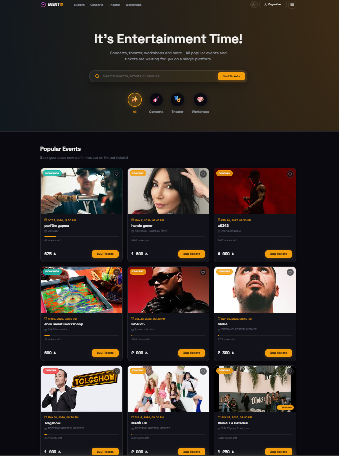
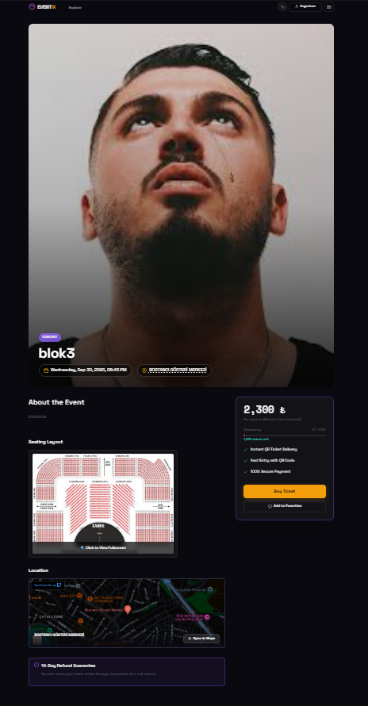
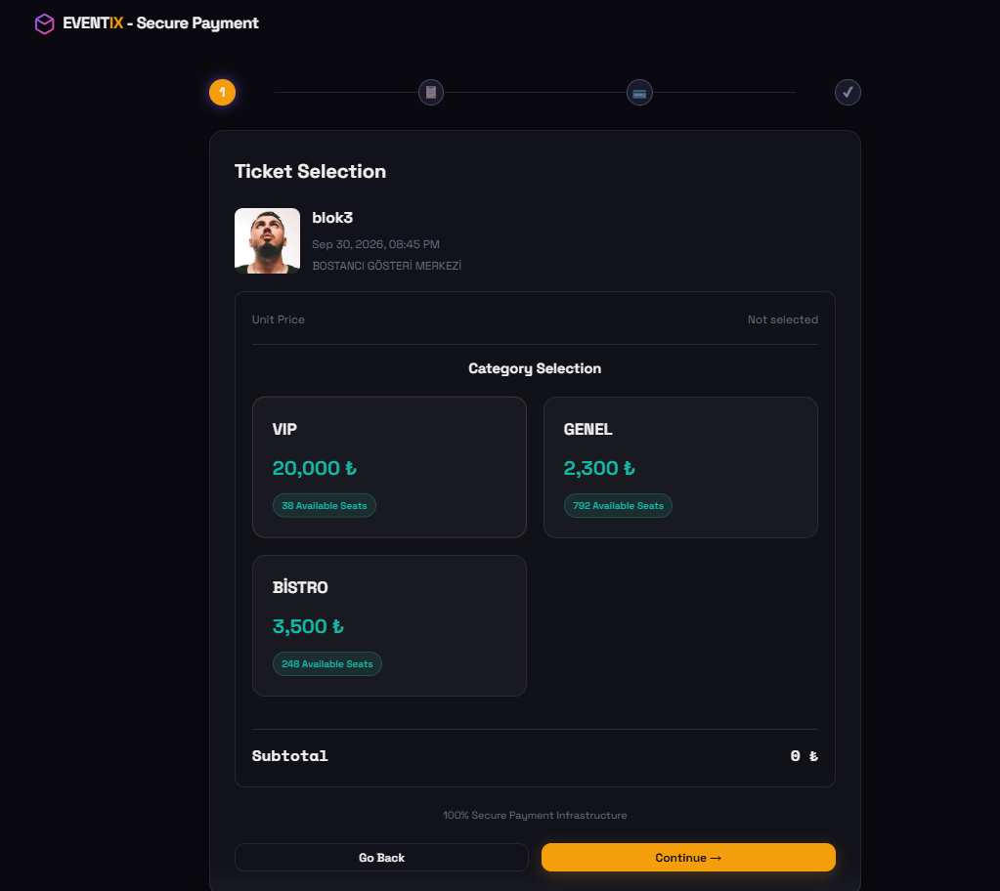
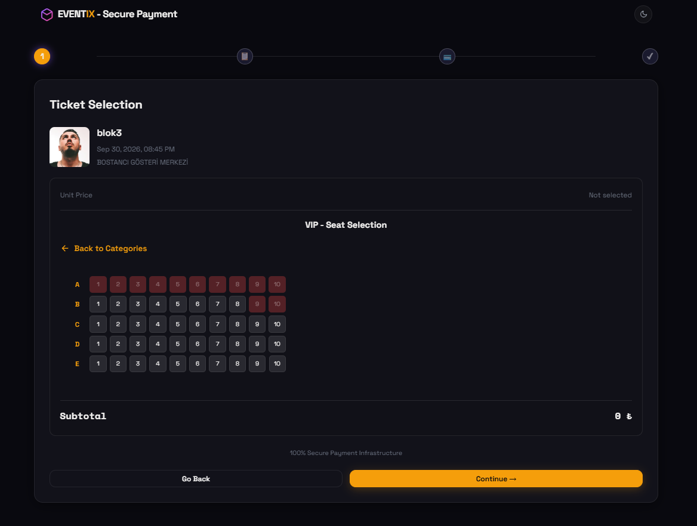
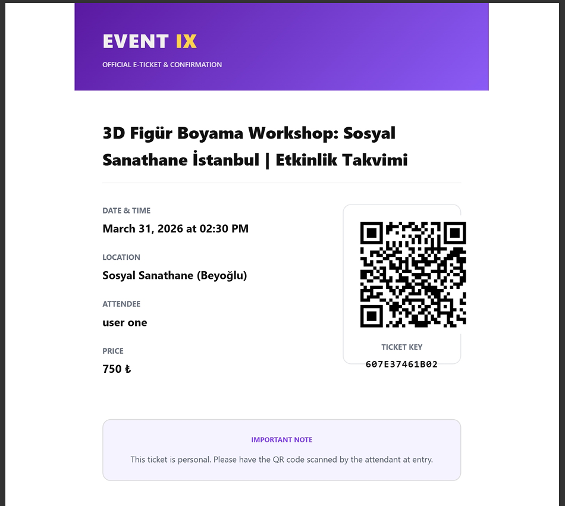
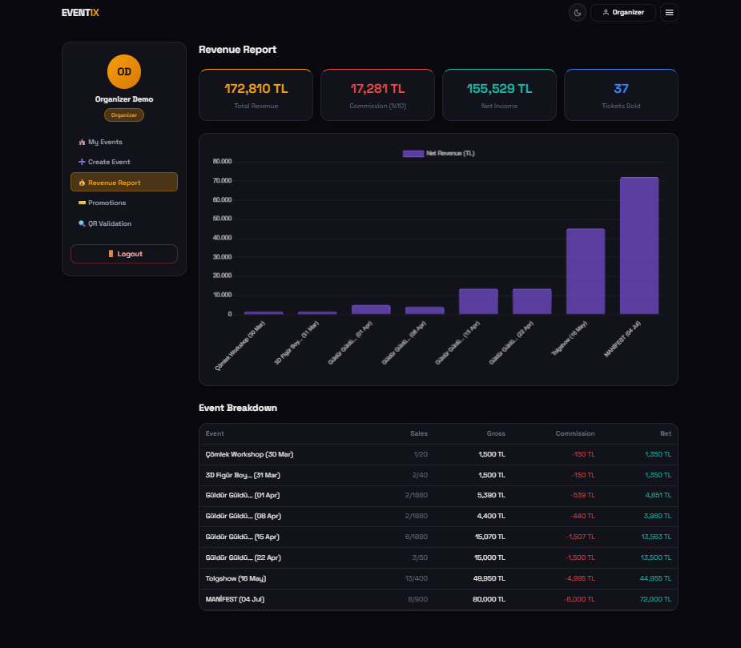
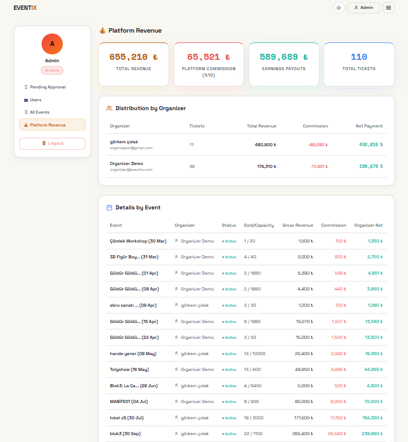
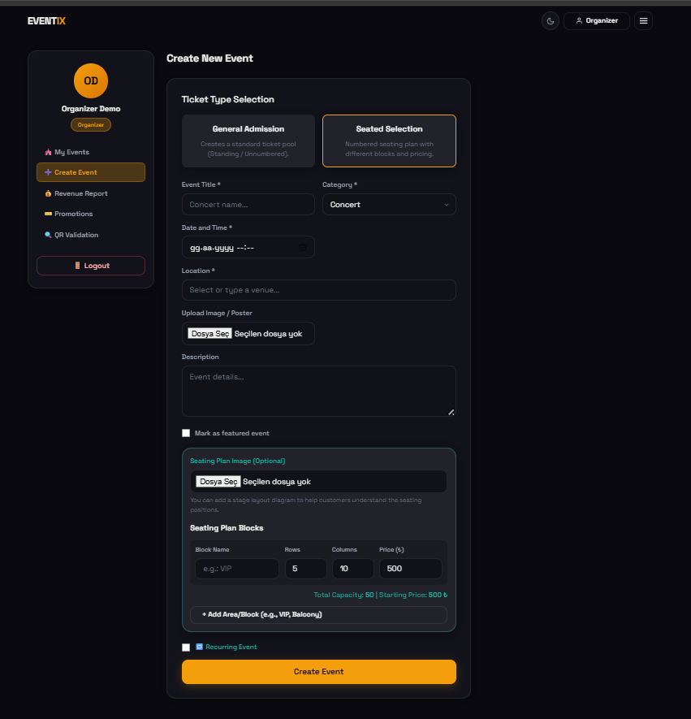

  
  <h1> ✨ Eventix ✨ </h1>
  <h3> 🚀 Yeni Nesil Akıllı Biletleme ve Etkinlik Yönetim Ekosistemi 🚀 </h3>
  
 💎 Minimalist Tasarım • ⚡ Kusursuz Hız • 🛡️ Maksimum Güvenlik 💎 

  

    
    
    
    
    
    
  

---

## 🌈 Vizyon ve Genel Bakış

**Eventix**, sıradan bir bilet alma sitesinin ötesinde; hem katılımcılar hem de organizatörler için tasarlanmış **premium bir deneyim merkezidir**. ✨ Canlı konserlerden workshop etkinliklerine kadar geniş bir yelpazede hizmet verir. 🌓 **Dinamik Tema Desteği** (Dark & Light Mode) ile kullanıcılara konforlu bir arayüz seçeneği sunar.

  

---

## ⚡ Öne Çıkan "Premium" Özellikler ⚡

### 🗺️ 1. İnteraktif Etkinlik Deneyimi
Kullanıcılar bir etkinliğe tıkladığında; yüksek çözünürlüklü afişler, mekanın **krokisi** (Seating Layout) ve Google Harita entegrasyonu ile karşılaşır. 📊 Kalan bilet sayıları ve kapasite anlık olarak güncellenir.

  

### 🎫 2. Akıllı Koltuk Seçimi (Smart Booking)
Karmaşık süreçleri rafa kaldıran Eventix, kusursuz bir rezervasyon akışı sunar:
*   🏁 **Kategori Ayrımı:** VIP, BİSTRO veya GENEL alanlar net şekilde ayrılmıştır.
*   💺 **Matris Seçim:** A'dan E'ye sıralar, 1'den 10'a koltuklar... İstediğin yeri tıkla ve ayırt!

| 💎 Kategori Seçimi | 💺 Koltuk Matrisi |
| :---: | :---: |
|  |  |

### ✉️ 3. Dijital E-Bilet (Anında Mail & QR)
Ödeme bittiği saniye; şifrelenmiş benzersiz bir **QR Kod** üretilir ve şık bir **E-Ticket** şablonuyla kullanıcının mail kutusuna ışınlanır! 📧 Kapıda sadece telefonunu göster ve geç! 🏃‍♂️💨

  

### 💰 4. Organizatör ve Finans Analitiği (Business Intel)
Dijital platformun kalbi veridir! 📈 Yetkilendirilmiş kullanıcılar için özel finans paneli:
*   💸 **Otamatik Hakediş:** %10 platform komisyonu otomatik kesilir, organizatör net kazancını görür.
*   📊 **Dinamik Grafikler:** Hangi etkinlik ne kadar kazandırdı? Satış oranları nedir? Hepsi görsel şölen tadında!

| 📈 Organizatör Raporu | 👑 Admin Finans Paneli |
| :---: | :---: |
|  |  |

### 🛠️ 5. Organizatörler İçin Esnek Etkinlik Oluşturma
Sistem, etkinlik sahiplerine (Organizatör) teknik bilgi gerektirmeden profesyonel etkinlikler oluşturma imkanı tanır:
*   🎟️ **Bilet Türü Seçimi:** Ayakta veya Numaralı Koltuklu etkinlikler arasında tek tıkla geçiş.
*   🗺️ **Blok Bazlı Planlama:** VIP, Balkon veya Protokol gibi sınırsız kategori, fiyat ve kapasite belirleme.
*   🔁 **Tekrar Eden Etkinlikler:** Günlük, haftalık veya aylık periyotlarda otomatik seans desteği.

  

---

## 🔐 Profesyonel İş Akışı ve Güvenlik Mekanizması

Eventix, sıradan bir web sitesi değil, yaşayan bir **iş ekosistemidir**:

*   🛡️ **Admin Onay Sistemi:** Organizatör tarafından oluşturulan her etkinlik önce "Beklemede" (Pending) olarak Admin paneline düşer. Yetkili onayı almayan hiçbir etkinlik satışa açılmaz.
*   🚫 **Merkezi Müdahale:** Admin, yayındaki herhangi bir etkinliği düzenleyebilir veya satışları anlık olarak durdurabilir.
*   🎫 **QR Doğrulama Portalı:** Organizatörler, etkinlik girişinde kamera ile biletleri "Geçerli" veya "Kullanıldı" olarak anlık kontrol edebilir.
*   🎁 **Promosyon Yönetimi:** Her etkinliğe özel sınırlı sayıda indirim kodları (Promo Codes) tanımlanabilir.

---

## 🧠 Sistem Zekası ve Gizli Kahramanlar

*   🎂 **Doğum Günü Sürprizi:** Arka planda çalışan asenkron iş parçacıkları (threading) ile doğum günü olan kullanıcılara otomatik tebrik mailleri gönderilir.
*   📱 **Tam Duyarlı (Responsive) Tasarım:** Dashboard paneli dahil tüm arayüz, mobilden masaüstüne kadar her cihazda kusursuz görüntülenir.
*   🌓 **Dual-Theme Desteği:** Kullanıcılar tek tıkla **Dark Mode** (Karanlık) ve **Light Mode** (Aydınlık) temalar arasında geçiş yapabilir.
*   🔐 **Hassas Veri Güvenliği:** Kullanıcı şifreleri en yüksek standartlarda (Bcrypt/SHA) hashlanarak saklanır, asla düz metin olarak barındırılmaz.

---

## 🛡️ Teknik Altyapı
*   ☁️ **Cloud Database:** **Turso Cloud** (Distributed SQLite) ile ışık hızında veri erişimi.
*   🔒 **Siber Güvenlik:** JWT Auth, **HMAC SHA-256** QR şifreleme ve Rate-Limiting koruması.
*   📫 **Async SMTP:** Sorunsuz bilet teslimat altyapısı.

---
## 📧 İletişim

**Eren Görkem Çolak** - [GitHub](https://github.com/gorkemcolakk) - [LinkedIn](https://www.linkedin.com/in/eren-g%C3%B6rkem-%C3%A7olak-06104b35a/)

  
<i>🌟 Katılımcılar için eşsiz bir deneyim, organizatörler için maksimum kontrol. 🌟</i>

  <b>🚀 Eventix Projesi © 2026 🚀</b>

